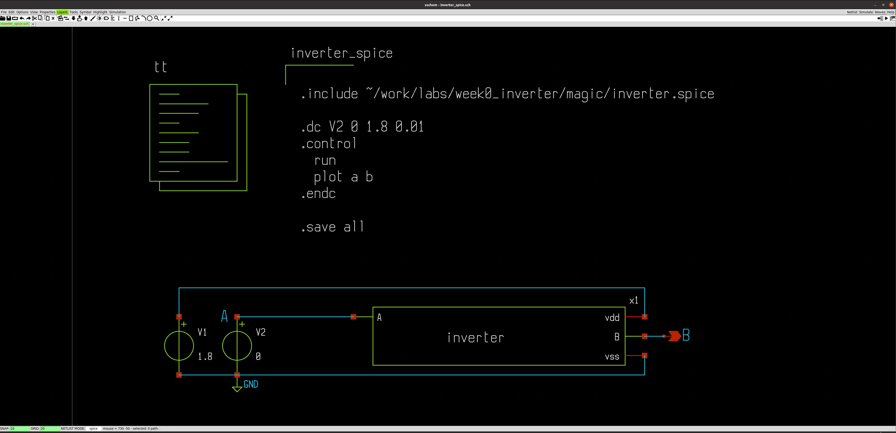
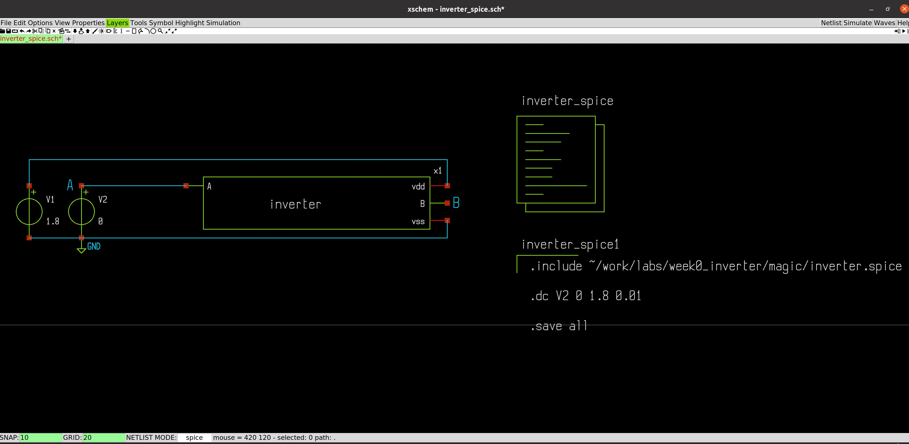
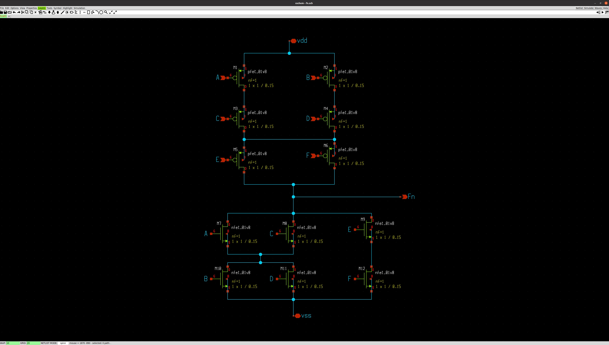

# Setup and Preparation

As a preparation for the work, we are going to install the following software in **Ubuntu 20.04**. I created the scripts in the following numbered order, it is best if they are run in the same order.

<br>

## Table of Contents 
| #  |         Topic          |   Description        | Status
|:--:|:-------------------------:|:--------------------:|:-----:|
| 1  | Setting up the tools      | Set up all the software and PDK required for the following labs|:white_check_mark:|
| 2  | Pre-layout characterization of inverter using xschem and ngspice | Create an inverter in xschem and run simulation|:white_check_mark:|
| 3  | Post-layout characterization of inverter using Magic, xschem, and ngspice| Create layout and extract netlist to run simulation|:white_check_mark:|
| 4  | LVS of the Inverter| Run layout vs schematic for two netlists|:white_check_mark:|
| 5  | Pre-layout characterization of Fn using xchem and ngspice | Create Fn=[(B+D).(A+C)+E.F]' in xschem and run simulation|:large_orange_diamond:|
| 6  | Post-layout characterization of Fn using Magic, xschem and ngspice | Create layout and extract netlist to run simulation|:large_orange_diamond:|
| 7  | LVS of the Fn function| Run layout vs schematic for two netlists of Fn|:white_check_mark:|


<br><br><br>


## 1. Setting up the tools

| #  |         Software          |   Description        |
|:-----------:|:-------------------------:|:--------------------:|
| 1           | [magic](https://github.com/rajivbishwokarma/msvsdasms/tree/master/week0#1-magic)                 |    Layout Editor    |
| 2           | [ngspice](https://github.com/rajivbishwokarma/msvsdasms/tree/master/week0#2-ngspice)               |    SPICE Simulation  |
| 4           | [xschem](https://github.com/rajivbishwokarma/msvsdasms/tree/master/week0#3-xschem)                |    Schematic Editor  |
| 3           | [netgen](https://github.com/rajivbishwokarma/msvsdasms/tree/master/week0#4-netgen)                |    Netlist Generator |
| 5           | [Open PDK (Sky130)](https://github.com/rajivbishwokarma/msvsdasms/tree/master/week0#open-pdk-sky130)     |    Sky130 library    |
| 6           | [ALIGN]()     |    Analog Netlist to GDS    |


### <p align="center"> Run all the provided scripts a non-root user </p>


The [0_run_all.sh](./0_run_all.sh) script runs all the scripts one after another. It should work and you are welcome to try, but I cannot verify that it works 100% as I have not tested it. I recommend running all the scripts one by one, in the given order for a tested setup.

In addition to the above scripts, I have also written a separate small script called [template.sh](./template.sh) that creates a folder structure for the design project and initializes the sub-folders with required files. 

**BIG NOTE: You can only run this script after running all the scripts given above.**
To use the **template.sh** script, do:

```
./template.sh     or     ./template.sh <design_name>
```

[Small note] If you want to run the **template.sh** script from anywhere within the system, then run the [export_template.sh](./export_template.sh) script using the following command [note the extra dot in the beginning].

```
. ./export_template.sh
```


For example, if you just use the template.sh without any design name, it will create a folder called **design** and then populate the sub-folders. If you supply a design name, say, **week0_inverter** then it will create a folder named **week0_inverter** and populate the sub-folders.


## 1. [Magic]()

Install Magic and all its dependencies using the [1_setup_magic.sh](./1_setup_magic.sh) script. Just do:

```
chmod +x 1_setup_magic.sh

./1_setup_magic.sh
```

## 2. [ngspice]()

Install **ngspice** and all its dependencies using the [2_setup_ngspice.sh](./2_setup_ngspice.sh) script. Just do:

```
chmod +x 2_setup_ngspice.sh

./2_setup_ngspice.sh
```

## 4. [netgen]()

Install **netgen** and all its dependencies using the [3_setup_netgen.shv](./3_setup_netgen.sh) script. Just do:

```
chmod +x 3_setup_netgen.sh

./3_setup_netgen.sh
```


## 4. [xschem]()

Install **xschem** and all its dependencies using the [4_setup_xschem.sh](./4_setup_xschem.sh) script. Just do:

```
chmod +x 4_setup_xschem.sh

./4_setup_xschem.sh
```

## 5. [Open PDK with Sky130]()

Install **Open PDK with Sky130 library** and all its dependencies using the [5_setup_openpdk.sh](./5_setup_openpdk.sh) script. Just do:

```
chmod +x 5_setup_openpdk.sh

./5_setup_openpdk.sh
```

## 6. [ALIGN](https://github.com/ALIGN-analoglayout/ALIGN-public)

Install **ALIGN** with the [6_setup_align.sh](./6_setup_align.sh) script. Do:
```
chmod +x 5_setup_openpdk.sh

./5_setup_align.sh
```

To, then, run the ALIGN tool, cd into ALIGN-public and do:
```
source general/bin/activate

schematic2layout.py <NETLIST_DIR> -p <PDK_DIR> -c
```

To test an example design named **inverter_v1**, cd into **work** folder within ALIGN-public directory and do:
```
schematic2layout.py ../examples/inverter_v1/ -p ../pdks/FinFET14nm_Mock_PDK/
```

## 6.1 [ALIGN-SKY130 PDK](https://github.com/ALIGN-analoglayout/ALIGN-pdk-sky130)

The ALIGN installation script should have installed the PDK inside **ALIGN-public/pdk/** folder. But in case it did not, follow the following steps.

To install the Sky130 PDK that is compatible with ALIGN tool, clone the following repo inside **ALIGN-public/pdk** folder.

```
git clone https://github.com/ALIGN-analoglayout/ALIGN-pdk-sky130
```
And, then use one of the examples to test the setup with:

```
schematic2layout.py ../pdks/ALIGN-pdk-sky130/examples/telescopic_ota/ -p ../pdks/ALIGN-pdk-sky130/SKY130_PDK/
```

<br><br>

## **2. Pre-layout characterization of inverter using xschem and ngspice**
We will first create an inverter using the Sky130 PDK that we installed through the OpenPDK. To do that, let's first create an inverter. 

<p align="center">
  
</p>

For the scematic above, we can create symbol in two ways. We generate the symbol through **Symbol->Make symbol from schematic (A)** and it will generate the symbol shown in the left. We can do it manually using the drawing tools provided within the **xschem** and I created the one on the right.

<p align="left">
  
  
</p>

When we create a custom symbol, we have to describe the global schematic property as given below. This is to make sure that SPICE recognizes our device when we use it in our design. This can be set by clicking anywhere in the blank space and pressing **q** and entering the below informatin in the text box that appears as shown in the figure below.

```
type=subcircuit
format="@name @pinlist @symname"
template="name=X1"
```
<p align="center">
  
</p>

I also created a buffer from the inverter as shown below (but have not done the simulation with it yet). 

<p align="left">
  
  
</p>


Now, characterizing the inverter circuit with the following setup leads to the output shown in the waveform.

In order to run the simulation, we have to add a **code** block with the following configuration. This is done so that SPICE can expand the sub-circuit call with the Sky130 library files.

```
name=tt only_toplevel=false value="
.lib /usr/local/share/pdk/sky130A/libs.tech/ngspice/sky130.lib.spice tt
"
```

Then, we can add following to the **code_shown** block with the to run a dc sweep analysis. 

```
name=inverter_spice only_toplevel=false value="
.dc v2 0 1.8 0.01

.control
  run
  plot a b
.endc

.save all"
```

<p align="center">
  
</p>

<p align="center">
  
</p>

And, generating the netlist and running the simulation, we get the following output waveform.

<p align="center">
  
</p>


<br><br>

## **3. Post-layout characterization of inverter using Magic, xschem, and ngspice**

We can either create an inverter in Magic from scratch and then extract the SPICE netlist as shown below, or we can import the netlist generated by xschem and then route the cells as shown in the next screenshot.

<p align="center">
  
</p>

<p align="center">
  
</p>

Then we extract the netlist using the following commands. 
```
extract all
ext2spice cthresh 0 rthresh 0
ext2spice
```
And we get the netlist for SPICE simulation.

Now, in order to run the post-layout simulation, we have to include this netlist in the xschem testbench shown above. To do that, we need to change which netlist **xschem** calls when it launches the simulation. 

Now, we will import this symbol to the testbench and add SPICE include command to include the newly generated spice.

<p align="center">
  
</p>

The inverter_spice code includes the directory to the Sky130 spice model files
```
name=tt only_toplevel=false value=
"
.lib /usr/local/share/pdk/sky130A/libs.tech/ngspice/sky130.lib.spice tt
"
```

<p align="center">
  
</p>

We get the following waveform, similar to what we got in the pre-layout simulation.

<p align="center">
  
</p>

Also doing a transient simulation to the input gate, we get the following waveform.

<p align="center">
  
</p>

This concludes the post-layout characterization of the inverter. 


## **4. LVS of the Inverter**

To run LVS, we first have to extract the netlist from layout in a different way using the following command. 

```
extract all
ext2spice lvs
ext2spice
```

This generates the netlist that xschem can compare one to one with the netlist generated from schematic. The lvs done on the two circuits outputs the following results. 

<p align="center">
  
</p>

## **5. Pre-layout characterization of Fn using xchem and ngspice**

Now, we will run a pre-layout and post-layout simulation for a custom function defined by:

$$ F_n = \overline{(B + D) \cdot (A + C)} + (E \cdot F)  $$

```
Fn = [(B + D) . (A + C) + E.F]'
```

We first draw the schematic circuit in **xschem** and then create a test circuit for the schematic. We get [this](./netlists/fn.spice) netlist from the current circuit. 

<p align="center">
  
</p>

<p align="center">
  
</p>

After verifying the simulation results, we will then move on to the layout design of the circuit. 

## **6. Post-layout characterization of Fn using Magic, xschem and ngspice**

We first import and arrange the transistors generated by **xschem**. The layout are designed based on the Euler-path obtained from the PMOS and NMOS networks. In this case, the optimal path was found to be **A-C-E-F-D-B**.

<p align="center">
  
</p>

:construction: Then we route connections in the design.

<p align="center">
  
</p>

Alternatively, we can create the layout completely from scratch using the standard paint feature in **Magic** as shown below.

<p align="center">
  
</p>

Then we can extract the netlist from this design using the following commands. 
```
extract all
ext2spice cthresh 0 rthresh 0
ext2spice
```

We get [this](./netlists/fnc.spice) netlist.

And, to do the post-layout simulation of this circuit. We repeat the same steps that we did with the inverter. Instead of defining global property of the symbol as 'subcircuit', we define it as 'primitive' and link the [**Magic** generated SPICE netlist](./netlists/fnc.spice).

## **7. LVS of the Fn function**
We then finally run the LVS for the Fn layout and schematic.