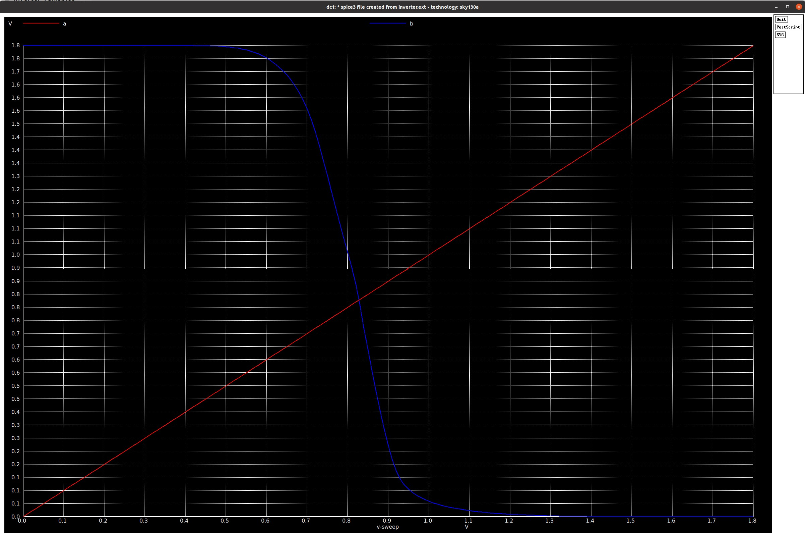

## Table of Contents 
| #  |         Topic          |   Description        | Status
|:--:|:-------------------------:|:--------------------:|:-----:|
| 1  | [Inverter: generating GDS2 using ALIGN](https://github.com/rajivbishwokarma/msvsdasms/tree/master/week1#1-generating-gds2-file-from-spice-netlist)      | Creating GDS2 file from the spice netlist using ALIGN |:white_check_mark:|
| 2  | [Inverter: Post-layout simulation of ALIGN generated layout](https://github.com/rajivbishwokarma/msvsdasms/tree/master/week1#2-inverter-post-layout-simulation-of-align-generated-layout)      | Extracting netlist and doing post-layout simulation |:white_check_mark:|
| 3  | [3. Comparision of pre-layout (xschem) and post-layout (Magic and ALIGN) outputs for Inverter](https://github.com/rajivbishwokarma/msvsdasms/tree/master/week1#3-comparision-of-pre-layout-xschem-and-post-layout-magic-and-align-outputs-for-inverter)      | Comparing the output waveform out of obtained from all three software |:large_orange_diamond:|
| 4  | [$F_n$: generating GDS2 using ALIGN](https://github.com/rajivbishwokarma/msvsdasms/tree/master/week1#4-fn-generating-gds2-file-from-netlist)      | Creating GDSII file from the spice netlist using ALIGN |:white_check_mark:|
| 5  | [$F_n$: Post-layout simulation of ALIGN generated layout]()      | Extracting netlist and doing post-layout simulation |:large_orange_diamond:|
| 6  | [$F_n$: Comparision of pre-layout (Xschem) and post-layout (Magic, ALIGN) simulation]()      | Extracting netlist and doing post-layout simulation |:large_orange_diamond:|


<br><br><br>


## 1. Generating GDS2 file from spice netlist

The people at ALIGN have given good working examples of how to convert a spice netlist describing a circuit to a GDS2 layout file. These examples can be found in their [GitHub page](https://github.com/ALIGN-analoglayout/ALIGN-pdk-sky130/tree/main/examples).

Now, I would have loved to do this: create circuit schematic in xschem, generate netlist, run ALIGN and **ta-da** your layout is ready. But, we are not at that stage yet. Maybe, someday. 

We first have to make the netlist generated from xschem compitable with the ALIGN tool. For an inverter, we get the following netlist generated from the given schematic diagram. 

<p align="center">
  
</p>

This netlist is generated from the above circuit diagram.

```
** sch_path: /home/rb/work/labs/week0_inverter/xschem/inverter.sch
**.subckt inverter B A vdd vss
*.opin B
*.ipin A
*.iopin vdd
*.iopin vss
XM1 B A vdd vdd sky130_fd_pr__pfet_01v8 L=0.15 W=1 nf=1 ad='int((nf+1)/2) * W/nf * 0.29' as='int((nf+2)/2) * W/nf * 0.29'
+ pd='2*int((nf+1)/2) * (W/nf + 0.29)' ps='2*int((nf+2)/2) * (W/nf + 0.29)' nrd='0.29 / W' nrs='0.29 / W'
+ sa=0 sb=0 sd=0 mult=1 m=1
XM2 B A vss vss sky130_fd_pr__nfet_01v8 L=0.15 W=1 nf=1 ad='int((nf+1)/2) * W/nf * 0.29' as='int((nf+2)/2) * W/nf * 0.29'
+ pd='2*int((nf+1)/2) * (W/nf + 0.29)' ps='2*int((nf+2)/2) * (W/nf + 0.29)' nrd='0.29 / W' nrs='0.29 / W'
+ sa=0 sb=0 sd=0 mult=1 m=1
**.ends
.end
```

The first thing we should do is change the name of the SPICE file by using the following command. 
```
mv inverter.spice inverter.sp
```

ALIGN does not recognize (to my knowledge) all the parameters passed to the cells in the netlist, therefore, we have to remove those make it as following. Then we will have to uncomment the subcircuit definition line. Then, we also have to take into account the L and W parameters as the scale of the circuit must be consistent.

```
.subckt inverter B A vdd vss

XM1 B A vdd vdd sky130_fd_pr__pfet_01v8 w=21e-7 l=0.15 nf=10 m=1
XM2 B A vss vss sky130_fd_pr__nfet_01v8 w=21e-7 l=0.15 nf=10 m=1

.ends
```

Then we have to source the [ALIGN-public/general/bin/activate]() to activate the ALIGN environment. Let's do this by doing the following from the home directory.

```
source ~/work/ALIGN-public/general/bin/activate
```

Then, we can then create a working directory called **work** inside the ALIGN-public folder and work from there. We will then move the inverter.sp file inside **inverter** folder within ALIGN-public. All of it can be done with the following. 

```
cd ~/work/ALIGN-public
mkdir work
mkdir inverter

# I copied and edited the inverter spice file inside ~/.xschem/simulation folder
mv ~/.xschem/simulation/inverter.sp .

cd work
```

Now, we are inside the **work** directory. In the previous week, I cloned the [ALIGN-pdk-sky130]() repo inside **ALIGN-public/pdks** directory, so I will be using that. 

Then, using the following command, we can run the SPICE to GDS2 generation.

```
schematic2layout.py ../inverter -p ../pdks/ALIGN-pdk-sky130/SKY130_PDK
```

This will generate the layout of the inverter as can be seen below.

<p align="center">
  
</p>

<br><br>

## **2. Inverter: Post-layout simulation of ALIGN generated layout**


The GDS2 file that we generated with ALIGN can be opened using magic. We simply have to open **Magic** using the sky130.tech technology file and then use the **Read GDS** option.

```
magic -d OGL -T ~/work/open_pdks/sky130/sky130A/libs.tech/magic/sky130A.tech &
```

From magic, we can use **File->Read GDS** and get this layout.

<p align="center">
  
</p>

:construction: **[FIX NEEDED]** As you can see, there are a lot of errors while reading the file.

Now, we can go ahead and extract the netlist from this layout. To do that, we will run the following commands. 

```
extract all
ext2spice cthresh 0 rthresh 0
ext2spice
```

And, it generates the following netlist.
```
* SPICE3 file created from INVERTER_0.ext - technology: sky130A

.option scale=5000u

X0 B A VSS VSS sky130_fd_pr__nfet_01v8 ad=117600 pd=4760 as=138600 ps=5700 w=420 l=30
X1 VSS A B VSS sky130_fd_pr__nfet_01v8 ad=0 pd=0 as=0 ps=0 w=420 l=30
X2 B A VSS VSS sky130_fd_pr__nfet_01v8 ad=0 pd=0 as=0 ps=0 w=420 l=30
X3 VSS A B VSS sky130_fd_pr__nfet_01v8 ad=0 pd=0 as=0 ps=0 w=420 l=30
X4 VSS A B VSS sky130_fd_pr__nfet_01v8 ad=0 pd=0 as=0 ps=0 w=420 l=30
X5 B A VSS VSS sky130_fd_pr__nfet_01v8 ad=0 pd=0 as=0 ps=0 w=420 l=30
X6 B A VSS VSS sky130_fd_pr__nfet_01v8 ad=0 pd=0 as=0 ps=0 w=420 l=30
X7 VSS A B VSS sky130_fd_pr__nfet_01v8 ad=0 pd=0 as=0 ps=0 w=420 l=30
X8 VSS A B VSS sky130_fd_pr__nfet_01v8 ad=0 pd=0 as=0 ps=0 w=420 l=30
X9 B A VSS VSS sky130_fd_pr__nfet_01v8 ad=0 pd=0 as=0 ps=0 w=420 l=30
X10 B A VDD VDD sky130_fd_pr__pfet_01v8 ad=117600 pd=4760 as=138600 ps=5700 w=420 l=30
X11 VDD A B VDD sky130_fd_pr__pfet_01v8 ad=0 pd=0 as=0 ps=0 w=420 l=30
X12 VDD A B VDD sky130_fd_pr__pfet_01v8 ad=0 pd=0 as=0 ps=0 w=420 l=30
X13 B A VDD VDD sky130_fd_pr__pfet_01v8 ad=0 pd=0 as=0 ps=0 w=420 l=30
X14 B A VDD VDD sky130_fd_pr__pfet_01v8 ad=0 pd=0 as=0 ps=0 w=420 l=30
X15 VDD A B VDD sky130_fd_pr__pfet_01v8 ad=0 pd=0 as=0 ps=0 w=420 l=30
X16 VDD A B VDD sky130_fd_pr__pfet_01v8 ad=0 pd=0 as=0 ps=0 w=420 l=30
X17 B A VDD VDD sky130_fd_pr__pfet_01v8 ad=0 pd=0 as=0 ps=0 w=420 l=30
X18 B A VDD VDD sky130_fd_pr__pfet_01v8 ad=0 pd=0 as=0 ps=0 w=420 l=30
X19 VDD A B VDD sky130_fd_pr__pfet_01v8 ad=0 pd=0 as=0 ps=0 w=420 l=30
C0 A VDD 3.05fF
C1 VDD B 4.20fF
C2 A B 1.32fF
C3 B VSS 3.59fF **FLOATING
C4 A VSS 2.26fF **FLOATING
C5 VDD VSS 9.40fF **FLOATING
```

[ :construction: ] From an initial look we can see that the layout and [netlist](./netlists/inverter/ngspice/INVERTER_ALIGN.spice) both are wrong. But still, we move on to simulate this extracted netlist. However, before we do that, we have to modify some parameters (again). The parameters that are generated by **ALIGN** cannot be processed by **ngspice**. Therefore, we have to re-edit the parameters so that they are similar to what we initially had before layout. Use [**this netlist**](./netlists/inverter/ngspice/INVERTER_0.spice) file as the reference. We still have the capacitances extracted from the layout, so that's a good thing?

When we run the netlist simulation, we get the following waveform as the result. And, this is pretty good, but how? Well, that's a story for investigation.

Doing a DC sweep in the gate of the inverter generates the following output waveform.
<p align="center">
  
</p>

And, doing a transient analysis generates the following output waveform.
<p align="center">
  
</p>

<br><br>

## **3. Comparision of pre-layout (xschem) and post-layout (Magic and ALIGN) outputs for Inverter**

As can be seen from the images below, the pre-layout and post-layout simulations produce similar nature of the waveforms, only difference being the actual delay time. 

<p align="center">
  
  
  
</p>

| Timing threshold variables  | Pre-layout | Post-layout (Magic)| Post-layout (ALIGN)|
|:---------------------------:|:----------:|:------------------:|:------------------:|
|slew_high_rise_thr (0.8*VDD) |   254ps    |                    |                    |
|slew_low_rise_thr (0.2*VDD)  |   100ps    |                    |                    |
|slew_high_fall_thr (0.8*VDD) |   400ps    |                    |                    |
|slew_low_fall_thr (0.2*VDD)  |   280ps    |                    |                    |
|delay                        |            |                    |                    |

<br><br>
## **4. Fn: generating GDS2 file from netlist**

[Previously](../week0/README.md), we did a pre-layout (using xschem) and post-layout (using Magic) simulation of the following function.

$$ F_n = \overline{(B + D) \cdot (A + C) + (E \cdot F)}  $$

and got the following circuit with the given results. 

<p align="center">
  
  
</p>

**xschem** generated [this](./scripts/fn_sim.spice) spice netlist and I added in some simulation inputs and the above waveform was the result.

Now, we will follow the same steps that we previously followed to generate the inverter layout. We fill first modify the netlist of this schematic circuit and then run the **schematic2layout.py** from ALIGN environment.

We have to prepare the netlist by making it similar to the one shown below. Notice how we have removed most of the parameters from each device and changed the size of the devices. Using sizes generated by **xschem** will result in a compilation error saying something in the lines of *width must be multiple of fin pitch : 210* ([issue#2](https://github.com/rajivbishwokarma/msvsdasms/issues/2)). Therefore, the following sizes have been taken, which is referenced from the buffer design in the [ALIGN-pdk-sky130](https://github.com/ALIGN-analoglayout/ALIGN-pdk-sky130/blob/main/examples/buffer/buffer.sp) repo.


Using the following netlist
```
.subckt fn_sim A B C D E F Y vdd vss
XM1 net1 A vdd vdd sky130_fd_pr__pfet_01v8 L=0.15e-9 W=21e-7 nf=10 m=1
XM2 net3 B vdd vdd sky130_fd_pr__pfet_01v8 L=0.15e-9 W=21e-7 nf=10 m=1
XM3 net2 C net1 net1 sky130_fd_pr__pfet_01v8 L=0.15e-9 W=21e-7 nf=10 m=1
XM4 net2 D net3 net3 sky130_fd_pr__pfet_01v8 L=0.15e-9 W=21e-7 nf=10 m=1
XM5 Y E net2 net2 sky130_fd_pr__pfet_01v8 L=0.15e-9 W=21e-7 nf=10 m=1
XM6 Y F net2 net2 sky130_fd_pr__pfet_01v8 L=0.15e-9 W=21e-7 nf=10 m=1
XM7 Y A net4 net4 sky130_fd_pr__nfet_01v8 L=0.15e-9 W=21e-7 nf=10 m=1
XM8 Y C net4 net4 sky130_fd_pr__nfet_01v8 L=0.15e-9 W=21e-7 nf=10 m=1
XM9 Y E net5 net5 sky130_fd_pr__nfet_01v8 L=0.15e-9 W=21e-7 nf=10 m=1
XM10 net4 B vss vss sky130_fd_pr__nfet_01v8 L=0.15e-9 W=21e-7 nf=10 m=1
XM11 net4 D vss vss sky130_fd_pr__nfet_01v8 L=0.15e-9 W=21e-7 nf=10 m=1
XM12 net5 F vss vss sky130_fd_pr__nfet_01v8 L=0.15e-9 W=21e-7 nf=10 m=1
.ends
```

Running ALIGN using the above netlist, we get the following run-log.
<p align="center">
  
</p>

And, finally, we can see the GDS2 file generated. We can use either KLayout to view the layout.

<p align="center">
  
</p>

We can also use Magic to view the generated layout as shown below.

<p align="center">
  
</p>


We then extract the capacitances and layout netlist using Magic by typing in following commands. There are still some errors while reading the GDS file in Magic ([issue#1](https://github.com/rajivbishwokarma/msvsdasms/issues/1))
```
extract all
ext2spice cthresh 0 rthresh 0
ext2spice
```
<br><br>

 ## **5. $F_n$: Post-layout simulation of ALIGN generated layout**

After extracting the netlist using Magic, we get the netlist [align/FN_SIM_0.spice](./netlists/fn/align/FN_SIM_0.spice) as output. And, we can remove the capacitances that are floating in the circuit and then we can add in some power sources to run the simulation as shown in [ngspice/FN_SIM_0](./netlists/fn/ngspice/FN_SIM_0.spice). Running the simulation we get the following output.

[ :construction: Wrong output, currently fixing]


<p align="center">
  
</p>

<br><br><br>
 ## **6. $F_n$: Comparision of pre-layout (Xschem) and post-layout (Magic, ALIGN) simulation**

We got the following output waveform by simulating the [Xschem generated netlist]().

<p align="center">
  
</p>

To get this waveform 

We got the following output waveform by simulating the [MAGIC extracted SPICE netlist]().

<p align="center">
  
</p>

We got the following output waveform by simulating the [ALIGN generated SPICE netlist]().

[ :construction: Wrong output, Needs fixing]
 <p align="center">
  
</p>