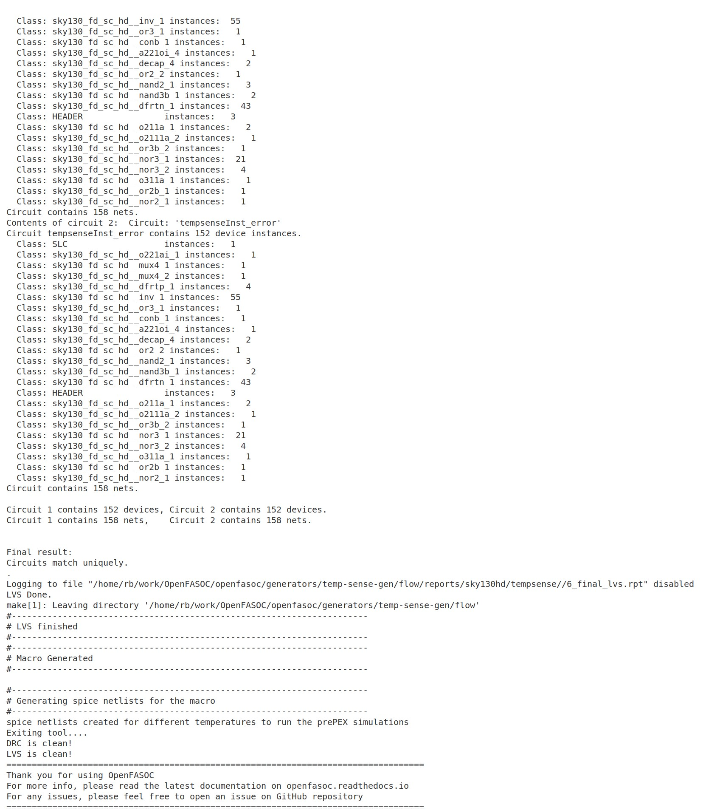

## Table of Contents 
| #  |         Topic          |   Description        | Status
|:--:|:-------------------------:|:--------------------:|:-----:|
| 1  | [Setting up OpenFASoC]()      | Installing OpenFASoC and all its dependencies |:white_check_mark:|
| 2  | [Configuring the Sky130A path]()      | Configuring the Sky130A path in the platform_config.json |:white_check_mark:|
| 3  | [Generating temperature sensor layout]()      | Installing OpenFASoC and all its dependencies |:white_check_mark:|


## 1. Setting up OpenFASoC

The dependendencies that are required to install OpenFASoC are always changing, so it is best to follow the related sources. Use the corresponding source that the following table provides. These dependencies can also be installed using the dependency script provided with OpenFASoC repo.

|  Dependencies | Version (21 Feb 2023) |             Note                    |
|:-------------:|:----------------------:|:-----------------------------------:|
| [Magic](https://github.com/RTimothyEdwards/magic)  |8.3.356| [opencircuitdesign.com](http://opencircuitdesign.com/magic/index.html)|
| [Netgen](https://github.com/RTimothyEdwards/netgen)|1.5.244|[opencircuitdesign.com](http://opencircuitdesign.com/netgen/index.html)|
| [Klayout](https://github.com/KLayout/klayout)|0.28.2-1|If error, install the **.deb** from [klayout.de](https://www.klayout.de/build.html)|
| [Yosys](https://github.com/The-OpenROAD-Project/yosys)|0.23+3|After install, **cd** into **/usr/bin** and do: **sudo ln -s /home/user/yosys-dir/yosys yosys**|
| [OpenROAD](https://github.com/The-OpenROAD-Project/OpenROAD)|2.0_6760|After install, **cd** into **/usr/bin** and do: **sudo ln -s /home/user/OpenROAD-dir/build/src/openroad**|
| [Open_pdks](https://github.com/RTimothyEdwards/open_pdks)|1.0.378|[opencircuitdesign.com](http://opencircuitdesign.com/open_pdks/)|

I found it easier to install [Anaconda](https://www.anaconda.com/products/distribution) and then install all the dependencies that OpenFASoC requires. After installing [Anaconda](https://www.anaconda.com/products/distribution), create an environment for OpenFASoC using the following command. 
```
# Create the environment with Python 3.7
conda create -n openfasoc python=3.7

# Activate the environment
conda activate openfasoc
```

OpenFASoC is a set of python scripts put together to run a complete flow. So, clone the OpenFASoC repo using the following command. 

```
# -j8 only works if the Git is 2.8+
git clone --recurse-submodules -j8 https://github.com/idea-fasoc/OpenFASOC.git
```

**Use this script to install cmake: [install_cmake.sh](./script/install_cmake.sh)** 

## **2. Configuring the Sky130A path**
Prior to running the temperature sensor generator, we have to set the sky130A path in file called [platform_config.json](https://github.com/idea-fasoc/OpenFASOC/blob/main/openfasoc/common/platform_config.json) that is inside **OpenFASOC/openfasoc/common/** directory. By default, the file will have the following entries.


We need to change them so that they reflect our path to the open_pdks/sky130.


<br><br>

## **3. Generating temperature sensor layout**

We have everything we need, so we can go ahead and run a test generator to generate a layout for [temperature sensor](https://github.com/idea-fasoc/OpenFASOC/tree/main/openfasoc/generators/temp-sense-gen) provided with OpenFASoC.

To do that, we first **cd** into the temp-sense-gen directory with the following command and do make.

cd ~/work/OpenFASOC/openfasoc/generators/temp-sense-gen

make

We will be presented with the following screen. 


This screen presents the running options that we have to generate the temperature sensor layout. 

First, we can either run **make** or use python directly using the following examples. 

```
make sky130hd_temp_verilog
```

And, we are presented with the following result. This option will only create the verilog files for the thermal sensor.


We can then run, the second make option using the following command. 

```
make sky130hd_temp ninv=6 nhead=3
```

And, this will present us with the following log of the run. 



After the run, all the files will be generated inside the **temp-sense-gen/flow/results/** folder as shown below. 


Then, reading the GDS file by opening **Magic** using the following command and then going to **File->Read GDS** will result in the following layout.

```
magic -d OGL -T ~/work/open_pdks/sky130/sky130A/libs.tech/magic/sky130A.tech &
```

