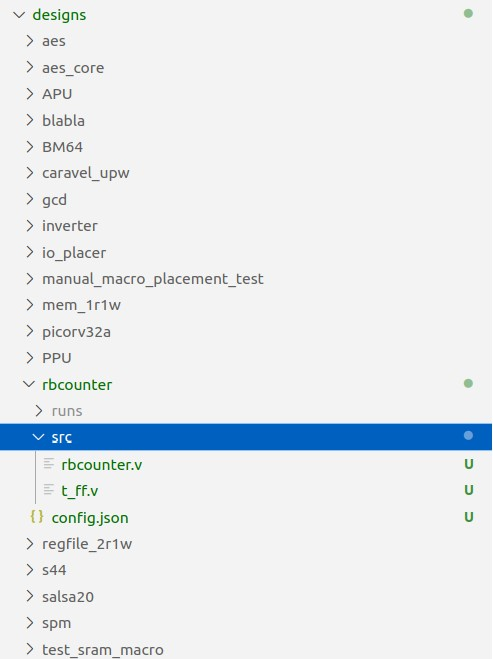
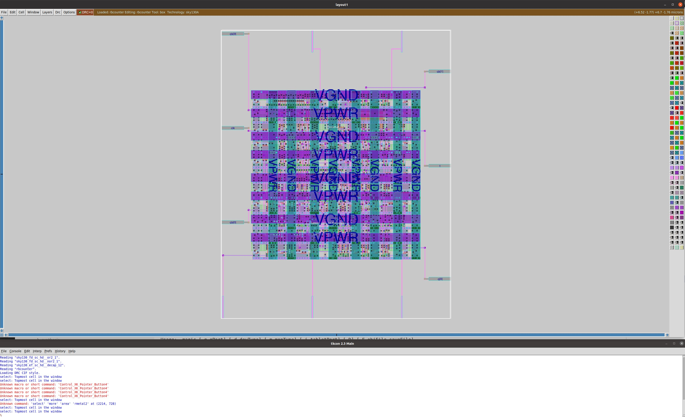

## Table of Contents 
| #  |         Topic          |   Description        | Status
|:--:|:-------------------------:|:--------------------:|:-----:|
| 1  | [Three-stage ring oscillator design in Xschem](https://github.com/rajivbishwokarma/msvsdasms/tree/master/week3#1-three-stage-ring-oscillator-design-in-xschem)      | Creating schematic circuit and simulatin it |:white_check_mark:|
| 2  | [Generating layout for ring oscillator using ALIGN](https://github.com/rajivbishwokarma/msvsdasms/tree/master/week3#2-generating-layout-for-ring-oscillator-using-align)      | Passing the xschem generated spice into ALIGN |:large_orange_diamond:|
| 3  | [Creating a manual layout for the ring oscillator using Magic](https://github.com/rajivbishwokarma/msvsdasms/tree/master/week3#3-creating-a-manual-layout-for-the-ring-oscillator-using-magic)      | Importing the xschem generated spice into Magic and routing the cells |:white_check_mark:|
| 4  | [Desining a 4-bit counter in Verilog]()      | Creating a 4-bit Verilog module and veryfing the output |:white_check_mark:|
| 5  | [Generating GDS2 for the 4-bit counter]()      | Taking the 4-bit counter through OpenLane flow to create a GDS2 file |:white_check_mark:|
| 6  | [Creating 1-bit ADC GDS schematic and layout]()      | Creating the final GDS2 file for the complete design |:large_orange_diamond:|
| 7  | [Generating GDS2 the complete 4-bit counter combined ring oscillator using OpenFASoC]()      | Creating the final GDS2 file for the complete design |:large_orange_diamond:|

<br><br>

## **1. Three-stage ring oscillator design in Xschem**

A ring oscillator is a self-toggling circuit that generates clock-like pulses without any external input, other than the power that it needs. This is created by cascading inverters back to back in odd numbers (so that the next output is different than the previous). Following figure shows the design of a 3-stage ring oscillator created in **Xschem**. 


This circuit generates the netlist provided here: [**ring_osc.spice**](./netlists/ring_osc.spice).

Then, the above circuit can be simulated using Xschem by creating the following testbench.


The netlist for the complete testbench with the ring oscillator is here: [**ring_osc_sym.spice**](./netlists/ring_osc.spice)

Running the simulation for 4 nanoseconds, we get the following output waveform. 


<br><br>

## **2. Generating layout for ring oscillator using ALIGN**

We can then move on to generating the layout for the ring oscillator using ALIGN layout tool. The first thing that we need to do is to modify the netlist that we got from Xschem into the following. The first netlist is a generic netlist and the second netlist is created following the way ALIGN-creators have [shown](https://github.com/ALIGN-analoglayout/ALIGN-public/blob/master/examples/ring_oscillator/ring_oscillator.sp).

**Netlist-1**
```
.subckt ring_osc Y vdd gnd
XM1 net1 Y vdd vdd sky130_fd_pr__pfet_01v8 L=150e-9 W=420e-9 nf=2
XM2 net1 Y gnd gnd sky130_fd_pr__nfet_01v8 L=150e-9 W=420e-9 nf=2
XM3 net2 net1 vdd vdd sky130_fd_pr__pfet_01v8 L=150e-9 W=420e-9 nf=2
XM4 net2 net1 gnd gnd sky130_fd_pr__nfet_01v8 L=150e-9 W=420e-9 nf=2
XM5 Y net2 vdd vdd sky130_fd_pr__pfet_01v8 L=150e-9 W=420e-9 nf=2
XM6 Y net2 gnd gnd sky130_fd_pr__nfet_01v8 L=150e-9 W=420e-9 nf=2
.ends
```

**Netlist-2** (The ALIGN-people way)
```
.subckt ring_oscillator_stage i y gnd vdd ctl
mp0 y i vdd ctl sky130_fd_pr__pfet_01v8 L=150e-9 W=420e-9 nf=2
mn0 y i gnd ctl sky130_fd_pr__nfet_01v8 L=150e-9 W=420e-9 nf=2
.ends

.subckt osc_align ctl y vdd gnd
xi0 n2 vo gnd vdd ctl ring_oscillator_stage
xi1 n1 n2 gnd vdd ctl ring_oscillator_stage
xi2 vo n1 gnd vdd ctl ring_oscillator_stage
.ends
```

Then, we have to save this new netlist with the **.sp** exension. For this, I am saving it as **ring_osc.sp**. 

The first netlist only requires the following two files to be present in one [directory](./netlists/ring_osc). 

+ [ring_osc.sp](./netlists/ring_osc/ring_osc.sp) 
+ [ring_osc.json](./netlists/ring_osc/ring_osc.json)

The second netlist requires following three files to be present in one [directory](./netlists/ring_osc_align).

+ [ring_osc.sp](./netlists/ring_osc_align/ring_osc_align.sp)
+ [ring_osc.json](./netlists/ring_osc_align/ring_osc.json)
+ [ring_osc_stage.const.json](./netlists/ring_osc_align/ring_osc_stage_const.json)


Then, we can run the ALIGN layout generator using the following command.

[Note: I am placing the netlists in the _ALIGN/designs/ring_osc_ directory and running ALIGN from _ALIGN/designs/work_ring_osc_ directory and my sky130 pdk root is: _~/work/ALIGN/pdks/ALIGN-pdk-sky130/SKY130_PDK_]

```
schematic2layout.py ../ring_osc -p ../../pdks/ALIGN-pdk-sky130/SKY130_PDK 
```

The run log can be seen in the image below. 


This has generated the following layout that was opened in Magic.


When we extract the spice netlist, we get this netlist: [RING_OSC_0.spice](./netlists/ring_osc/result/RING_OSC_0.spice)

We use these commands to extract the netlist.
```
extract all
ext2spice cthresh 0 rthresh 0
ext2spice
```

Then, adding the design to a testbench as shown in this netlist: [ring_osc_sim_align.spice](./netlists/ngspice/ring_osc_sim_align.spice), we get the following output waveform.

:underconstruction: [[Issue #3](https://github.com/rajivbishwokarma/msvsdasms/issues/3): Wrong output generation]


<br><br>

## **3. Creating a manual layout for the ring oscillator using Magic**

[Note: I did this step just to just for fun, so not important to follow along.]

We can then go ahead and create a layout manually using Magic. To do that, we first import the netlist generated by Xschem and then arrange and route the cells as shown below.


We then extract the netlist and get this netlist [ring_osc.spice](./netlists/magic/ring_osc.spice) as a result.

Then, repeating the same steps that we followed in simulating ALIGN generated netlist, we create this testbench: [ring_osc_sim_magic.spice](./netlists/ngspice/ring_osc_sim_magic.spice).

We get the following waveform as the result of the simulation.


And, this output validates the working of out layout created in Magic.

<br><br>

## **4. Designing 4-bit counter in Verilog**

Now that we have done an analog-design flow using ALIGN, we are going to work on the digital side of the design, i.e., the counter. We will be using T-FlipFlops to design a 4-bit up-counter that counts from 0 to 15. The schematic for this design can be seen in the image below.


The Verilog code that generated this schematic circuit is provided here: [rbcounter.v](./src/rbcounter.v). The waveform can be seen below.


This schematic can be verified using the testbench given here: [tb_rbcounter.v](./src/tb_rbcounter.v)

The main [rbcounter.v](./src/rbcounter.v) module is created from the T-FlipFlop that is implemented here: [t_ff.v](./src/t_ff.v). This, T-FlipFlop is verified using the testbench implemented here: [tb_t_ff.v](./src/tb_t_ff.v).


<br><br>

## **5. Generating GDS2 file for the 4-bit counter**

We can then run the [OpenLane](https://github.com/efabless/openlane) GDS2RTL flow. To do that, we first have to add our design in the OpenLane design directory and generate the configuration file. To do that, we can just follow this documentation: [Adding your designs](https://openlane.readthedocs.io/en/latest/usage/designs.html)

Summarizing the documentation, we can create a folder with the project name within **OpenLane/designs/** directory and add the source Verilog files inside the (this is the complete directory structure) **OpenLane/designs/src** folder and run the following command to generate the configuration file.

```
./flow.tcl -design <design_name> -init_design_config -add_to_designs
```

This will generate the following (.json) configuration and our complete structure will look like the directory structure given below. *The **runs** folder will be created after the flow is run*.

<p align="center">
 
</p>

We then have to edit the configuration file and put appropriate values. For this design, with trail and error, I created the final configuration file given here: [config.json](./openlane_rbcounter/designs/rbcounter/config.json). 

Then, running the flow using the following command generated the final GDS file provided below.

```
./flow.tcl -design rbcounter
```

The OpenLane flow generated the following run-log. 

<p align="center">
 
</p>


And, the OpenLane flow generated the following layout for the **rbcounter**. 

<p align="center">
 
</p>

The DRC and LVS reports generated by OpenLane show that the design has 0 violations. 

<p align="center">
 
</p>

<br><br>


## **6. Creating 1-bit ADC GDS schematic and layout using ALIGN/Magic**

Before running the whole design through the OpenFASoC flow, we first have to interface the analog and digital systems. This is done using an analog-to-degital (ADC) converter. For our design, we are only converting one-bit analog value to a digital value (clock), there a simple 1-bit ADC is required. 

The following schematic circuit shows the schematic for the 1-bit ADC using an Opamp.

<p align="center">
 
</p>


Then, we use the following testbench circuit to test the 1-bit ADC that we designed. 

<p align="center">
 
</p>

Running the simulation in **ngspice**, currently I am getting the following error. This needs to be investigated. 

<p align="center">
 
</p>

<br><br>

## **7. Generating GDS2 the complete 4-bit counter combined ring oscillator using OpenFASoC**