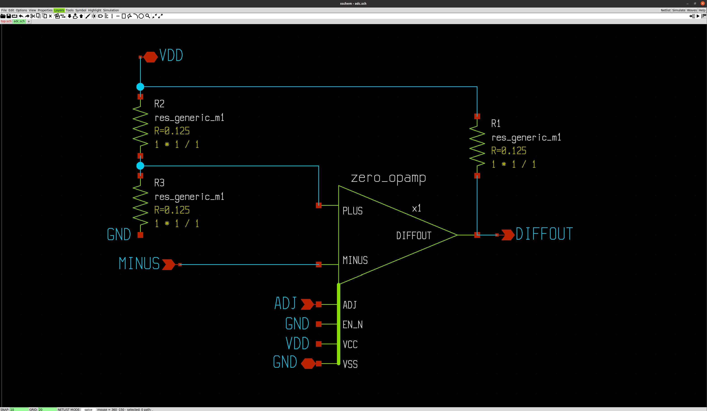
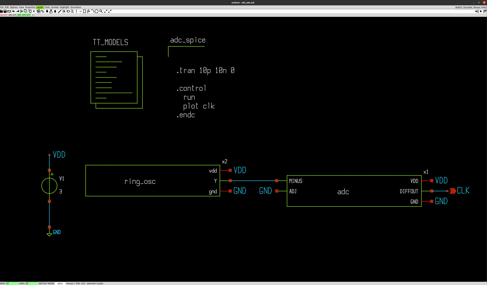
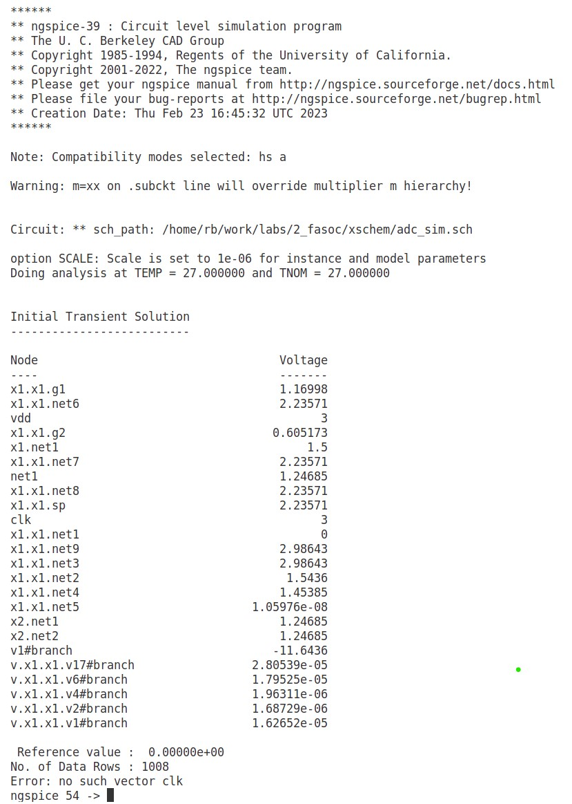

## Table of Contents 
| #  |         Topic          |   Description        | Status
|:--:|:-------------------------:|:--------------------:|:-----:|
| 1  | [Creating 1-bit ADC GDS schematic and layout]()      | Creating the final GDS2 file for the complete design |:large_orange_diamond:|
| 2  | [Generating GDS2 the complete 4-bit counter combined ring oscillator using OpenFASoC]()      | Creating the final GDS2 file for the complete design |:large_orange_diamond:|

  

## **1. Creating 1-bit ADC GDS schematic and layout using ALIGN/Magic**

Before running the whole design through the OpenFASoC flow, we first have to interface the analog and digital systems. This is done using an analog-to-degital (ADC) converter. For our design, we are only converting one-bit analog value to a digital value (clock), there a simple 1-bit ADC is required. 

The following schematic circuit shows the schematic for the 1-bit ADC using an Opamp.

 

Then, we use the following testbench circuit to test the 1-bit ADC that we designed. 

 

Running the simulation in **ngspice**, currently I am getting the following error. This needs to be investigated. 

 

  

## **2. Generating GDS2 the complete 4-bit counter combined ring oscillator using OpenFASoC**